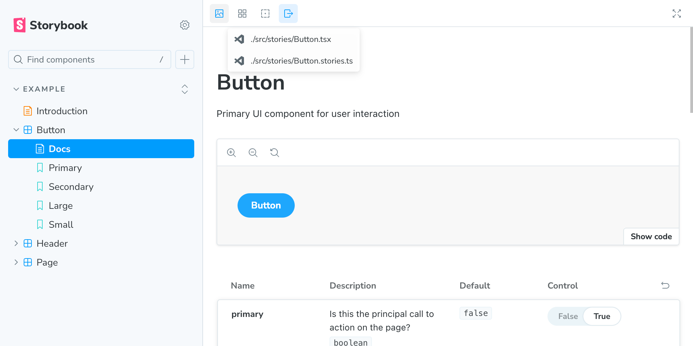

# storybook-addon-source-link



This addon adds links to open the source code of story or components in your editor.

## Getting started

### 1. Install the addon.

```sh
npm install -D my-addon
# or
yarn add -D my-addon
# or
pnpm add -D my-addon
```

### 2. Register the addon in your Storybook configuration.

Then, register it as an addon in `.storybook/main.js` (or `.storybook/main.ts`).

```ts
// .storybook/main.ts
import type { StorybookConfig } from "@storybook/your-framework";

const config: StorybookConfig = {
  // ...rest of config
  addons: [
    // ...other addons
    "storybook-addon-source-link",
  ],
};

export default config;
```

### 3. (Optional) Configure the addon.

You can modify or add links using `.storybook/preview.ts` or the parameters of a Story.

```ts
import type { Preview } from "@storybook/react";
import {
  type SourceLinkParameter,
  getFileUrl,
} from "storybook-addon-source-link";

const preview: Preview = {
  parameters: {
    // ...other parameters
    sourceLink: {
      links: {
        // override addon's default link
        "story-vscode": ({ importPath, rootPath, isStaticBuild }) => {
          if (isStaticBuild) return undefined;
          if (!rootPath) return undefined;
          const fileUrl = getFileUrl(rootPath, importPath);
          const href = `vscode://${fileUrl.href}`;
          return {
            label: importPath.split("/").at(-1) ?? "",
            href,
            icon: "StorybookIcon",
          };
        },

        // add a new link type
        "story-github": ({ importPath, rootPath }) => {
          if (!rootPath) return undefined;
          const href = `https://github.com/elecdeer/storybook-addon-source-link/blob/-/packages/demo${importPath.replace(/^\./, "")}`;
          return {
            label: importPath,
            href,
            icon: "GithubIcon",
          };
        },
      },
    } satisfies SourceLinkParameter,
  },
};

export default preview;
```

## API

### Parameters

This addon contributes the following parameters to Storybook, under the `sourceLink` namespace.

> [!TIP]
> Storybook parameters can be specified at the story, component, and global levels, and are merged for each value.
>
> https://storybook.js.org/docs/writing-stories/parameters

#### `links`

Type: `{ [key: string]: LinkEntry | undefined | ((context: ResolveContext) => LinkEntry | undefined) }`

If `undefined` is returned, the link will not be added.

- `ResolveContext`:
  - `importPath`: The path to the source file. e.g. `"./src/stories/Button.tsx"`
  - `rootPath`: The path to the root directory of the source files. e.g. `"/Users/username/project"`. If `isStaticBuild` is `true`, this value is `""`.
  - `isStaticBuild`: Whether the Storybook is built statically.
- `LinkEntry`:
  - `label`: The label of the link.
  - `href`: The URL of the link.
  - `icon`: (Optional) The icon name in [@storybook/icons](https://main--64b56e737c0aeefed9d5e675.chromatic.com/?path=/docs/introduction--docs)
  - `order`: (Optional) When order is specified, it will be sorted in ascending order. The default value is `0`.

### Preset settings provided by the addon

```ts
// preview.tsx

const preview: Preview = {
  parameters: {
    sourceLink: {
      links: {
        "component-vscode": ({ importPath, rootPath }) => {
          if (!rootPath) return undefined;
          const componentPath = importPath.replace(/\.stories\.tsx?$/, ".tsx");
          const componentFileUrl = getFileUrl(rootPath, componentPath);
          return {
            label: componentPath,
            href: `vscode://${componentFileUrl.href}`,
            icon: "VSCodeIcon",
          };
        },
        "story-vscode": ({ importPath, rootPath }) => {
          if (!rootPath) return undefined;
          const fileUrl = getFileUrl(rootPath, importPath);
          const href = `vscode://${fileUrl.href}`;
          return {
            label: importPath,
            href,
            icon: "VSCodeIcon",
          };
        },
        "addon-powered-by": {
          label: "Powered by addon-source-link",
          href: "https://github.com/elecdeer/storybook-addon-source-link",
          order: Number.MAX_SAFE_INTEGER,
          icon: "InfoIcon",
        },
      },
    } satisfies SourceLinkParameter,
  },
};
```
